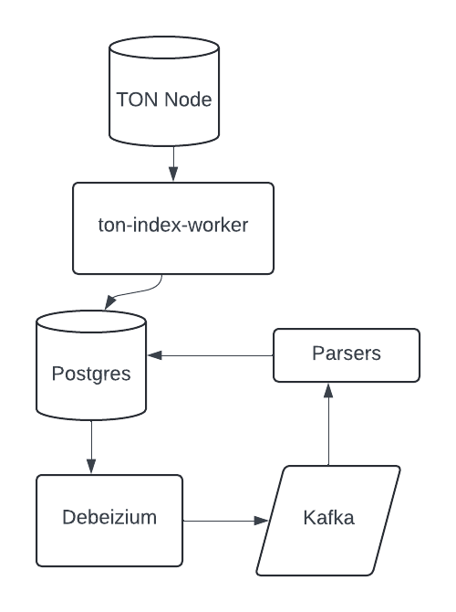

# TON-ETL indexing in decoding pipeline

The repository contains the code for the indexing and decoding pipeline for the TON blockchain.
IT is based on [ton-indexer-worker](https://github.com/toncenter/ton-index-worker) by [Toncenter](https://toncenter.com/).
[ton-indexer-worker](https://github.com/toncenter/ton-index-worker) ingests raw data into Postgres DB
and perform basic parsing for jettons and NFTs, then the data flows via [Debeizum](https://debezium.io/) to 
Kafka topics and being processed by [parsers](./parser/).

Overall architecture is shown on the diagram below:



Postgres, Debeizum and Kafka are running in Docker, deployment configs are in [docker-compose.yml](./docker-compose.yml).

# Deployment

It is recommended to run database and TON Node with indexer on separate servers. Consider using high-performance
SSD disks for database and TON Node. 

## Node + Indexer

Use [official documentation](https://docs.ton.org/participate/nodes/node-types) to start node using [dumps](https://dump.ton.org/).
Note that you don't require to wait for the node to sync the blockchain, you can start indexing right away.
You can [compile indexer from sources](https://github.com/toncenter/ton-index-worker) and run it on the same server as node,
or use [docker-compose](./indexer/docker-compose.yml) provided.

## Database

Use [docker-compose](./database/docker-compose.yml) to start Postgres DB, Debeizium and Kafka. It is recommended to increase Kakfa limits
due to huge account states could cause Debeizium to fail. To do that you need to get ``server.properties`` from
Kafka (````cdc-using-debezium-kafka:/opt/bitnami/kafka/config/server.properties````) and add following settings:

````sh
buffer.memory=200000000
max.request.size=200000000
message.max.bytes=200000000
max.partition.fetch.bytes=200000000
````

Also for better observability you can add JMX exporter to Kafka:
1. Download [jmx_exporter](https://github.com/prometheus/jmx_exporter/releases/tag/1.0.1)
2. Download kafka config for jmx exporter [kafka-2_0_0.yml](https://github.com/prometheus/jmx_exporter/blob/main/example_configs/kafka-2_0_0.yml)
3. Metrics would be available on localhost:7072/metrics


After starting you can create Debeizum connector:

````sh
curl --location 'http://localhost:8083/connectors' \
   --header 'Accept: application/json' \
   --header 'Content-Type: application/json' \
   --data '{
   "name": "cdc-using-debezium-connector",
   "config": {
       "connector.class": "io.debezium.connector.postgresql.PostgresConnector",
       "database.hostname": "postgres",
       "database.port": "5432",
       "database.user": "postgres",
       "database.password": "???????", # put your PG password here
       "database.dbname": "ton_index_v2", # your DB name
       "topic.prefix": "ton",
       "topic.creation.default.partitions": 10,
       "topic.creation.default.replication.factor": 1,
       "transforms": "unwrap",
       "transforms.unwrap.type": "io.debezium.transforms.ExtractNewRecordState",
       "transforms.unwrap.add.fields": "op,table,lsn,source.ts_ms",
       "transforms.unwrap.add.headers": "db",
       "transforms.unwrap.delete.tombstone.handling.mode": "drop",
       "key.converter": "org.apache.kafka.connect.json.JsonConverter",
       "key.converter.schemas.enable": "false",
       "value.converter": "org.apache.kafka.connect.json.JsonConverter",
       "value.converter.schemas.enable": "false",
       "producer.override.max.request.size": "1073741824"
   }
}'
````

## Parser

Before running parser you need to prepare local env file parser.env in [parser](./parser/) directory:
```sh
PGDATABASE=ton_index_v2
PGHOST=postgres
PGUSER=postgres
PGPORT=5432
PGPASSWORD= <<< your password here
KAFKA_BROKER=cdc-using-debezium-kafka:29092
```

To run parsers just simply use ``docker-compose up -d`` in [parser](./parser/) directory.
Each parser can handle multiple event types (described in the DB schema part), also 
you can scale number of parser instances to handle more events per second.

## Datalake exporter

Datalake exporter listens to Kafka topics with specific tables and exports data to S3. AVRO file format
is used to export data. After the launch exporter discovers schema from PostgresDB and use this schema for
AVRO serialization.

# DB Schema

DB contains multiple schemas:
* public - raw data from ton-index-worker
* parsed - parsed data
* prices - tables related to prices, TVL and other DeFi events

## public

Contains raw data from ton-index-worker:
* blocks - block data
* transactions - transaction events
* messages - messages (internal messages will be present twice with direction in and out flags)
* message_contents - raw message bodies
* nft_items, nft_collections, nft_transfers, getgems_nft_sales, getgems_nft_auctions - NFT data
* jetton_burns, jetton_transfers, jetton_wallets, jetton_masters - Jettons data 
* latest_accounts_states - latest account states and raw data and code bodies

## parsed

Contains parsed data produced by [parsers](./parser/).
All tables produced from messages include tx_hash, trace_id and event_time (transaction time).

### mc_libraries

Auxiliary table to store masterchain libraries data. It is required to have libraries when you run 
TVL emulator, to avoid costly network requests libraries are cached in this table.

### message_comments

Contains decoded text comments. Produced by [CommentsDecoder](./parser/parsers/message_contents/decode_comment.py) from
message_contents items.

### nft_history

Contains NFT transfers, sales and auctions history. Produced by [NftHistoryParser](./parser/parsers/nft_transfer/nft_history.py)
from nft_transfers stream, also uses getgems_nft_sales and getgems_nft_auctions items.

### jetton_mint

Contains jetton mint events. Produced from messages table stream
with [JettonMintParser](./parser/parsers/message/jetton_mint.py). 

### dex_swap_parsed

Supported DEXs:
* DeDust: [DedustSwap](./parser/parsers/message/dedust_swap.py)
* Ston.fi: [StonfiSwap](./parser/parsers/message/stonfi_swap.py)
* Ston.fi v2: [StonfiSwapV2](./parser/parsers/message/stonfi_swap_v2.py)
* Megaton: [MegatonSwap](./parser/parsers/jetton_transfer/megaton.py)

Each parser estimates deal volume in TON and USD using core prices (see below). So for swaps with core assets like
TON, stablecoins or LSDs volume will be estimated based on the core asset price at the moment of the swap. Otherwise
(like swaps between jettons) volume will be null.


### tradoor_perp_order

Contains decoded Tradoor Perp Order events. Produced from messages table stream
with [TradoorPerpOrder](./parser/parsers/message/tradoor_trades.py) parser. 

### tradoor_perp_position_change

Contains decoded Tradoor Perp Position Change events. Produced from messages table stream
with [TradoorPerpPositionChange](./parser/parsers/message/tradoor_trades.py) parser. 

### tradoor_option_order

Contains decoded Tradoor Option Order events. Produced from messages table stream
with [TradoorOptionOrder](./parser/parsers/message/tradoor_trades.py) parser. 

### gaspump_trade

Contains decoded GasPump trade events. Produced from messages table stream
with [GasPumpTrade](./parser/parsers/message/gaspump.py) parser. 

### tonfun_bcl_trade

Contains decoded [TonFun](https://github.com/ton-fun-tech) trade events. Produced from messages table stream
with [TonFunTrade](./parser/parsers/message/tonfun.py) parser. 
Includes following fields:
* bcl_master - jetton master address. According to TONFun architecture the same jetton master is used after the token leaves the bonding curve.
* event_type - ``Buy``, ``Sell`` or ``SendLiq``. ``SendLiq`` is used for the event when liquidity is collected from the bonding curve and sent to DEX (Ston.fi)
* trader_address - address of the trader. None for the ``SendLiq`` event (but actually in most cases ``SendLiq`` occurs after the ``Buy`` event and has the same ``trace_id``)
* ton_amount - amount of TON sold/bought (zero for ``SendLiq``)
* bcl_amount - amount of jetton bought/sold (zero for ``SendLiq``)
* referral_ver - referral version. TONFun protocol allows to set arbitrary referral cell and the cell starts with 32-bit version (opcode). The only supported
opcode is crc32(ref_v1).
* partner_address, platform_tag, extra_tag - referral addresses provided by the trader

### evaa_supply

Contains decoded EVAA supply events. Produced from messages table stream
with [EvaaSupplyParser](./parser/parsers/message/evaa.py). 

EVAA pools:
* EQC8rUZqR_pWV1BylWUlPNBzyiTYVoBEmQkMIQDZXICfnuRr - EVAA main pool
* EQBIlZX2URWkXCSg3QF2MJZU-wC5XkBoLww-hdWk2G37Jc6N - EVAA LP pool
* EQBozwKVDya9IL3Kw4mR5AQph4yo15EuMdyX8nLljeaUxrpM - Coffin pool (EVAA fork)

### evaa_withdraw

Contains decoded EVAA withdraw events. Produced from messages table stream
with [EvaaWithdrawAndLiquidationParser](./parser/parsers/message/evaa.py). 

### evaa_liquidation

Contains decoded EVAA liquidation events. Produced from messages table stream
with [EvaaWithdrawAndLiquidationParser](./parser/parsers/message/evaa.py). 

## prices

Tables related to DeFi - DEX trades, TVL, LSD prices, etc..


### core

TON/USDT prices, LSD prices and other prices originated from single smart-contracts.

* TON/USDT price is recovered by [CorePricesUSDT](./parser/parsers/accounts/core_prices.py) parser from ston.fi TON/USDT pool
* [CorePricesLSDstTON](./parser/parsers/accounts/core_prices.py), [CorePricesHipoTON](./parser/parsers/accounts/core_prices.py) and [CorePricesLSDtsTON](./parser/parsers/accounts/core_prices.py) are used
to extract prices for stTON, hTON and tsTON
* [CorePricesStormTrade](./parser/parsers/accounts/core_prices.py) extracts vaults converstion rate between LP token and underlying asset

###  dex_trade

Almost the same as __parsed.dex_swap_parsed__, but contains prices for base asset. Produced by [PriceDiscovery](./parser/parsers/swaps/price_discovery.py) parser.

### agg_price

Aggregated prices based on the recent DEX swaps. Produced by [PriceDiscovery](./parser/parsers/swaps/price_discovery.py) parser.
Aggregation algorithm is provided in __update_agg_prices__ method in [db.py](./parser/db.py)

### dex_pool

Unique DEX pools. Populated after each swap detected, updated by [TVLPoolStateParser](./parser/parsers/accounts/tvl.py) parser. 
The parser executes get methods on pool smart-contracts to get pool state, estimates TVL in TON and USD and updates __dex_pool__ table.

### dex_pool_history

Contains the history of DEX pools changes. Produced by [TVLPoolStateParser](./parser/parsers/accounts/tvl.py) parser.

### dex_pool_link

Helper table to map pools tokens to pools. Having this table it is possible to get top tokens by TVL:
```sql
select jetton, sum(tvl_usd) / 2 as total_tvl from prices.dex_pool_link
join prices.dex_pool using (pool)
where tvl_usd > 0
group by 1 order by total_tvl desc limit 10
```


## Other parsers

If you will start indexing not from the genesis block but rather from some recent block
you have to recover all states for the accounts and jetton_wallets and NFT items.
To do it you should use [ton-smc-scanner](https://github.com/toncenter/ton-index-worker/tree/main/ton-smc-scanner) 
tool from ``ton-index-worker`` to populate all accounts states first. Since this
tool doesn't update jetton wallets and NFT items you can use special parsers to recover all jettton wallets and NFT items:
* [NFTsRecover](./parser/parsers/accounts/nfts_recover.py) - recovers NFTs from the latest_accounts_states table
* [JettonWalletsRecover](./parser/parsers/accounts/jetton_wallets_recover.py) - recovers jetton wallets from the latest_accounts_states table
